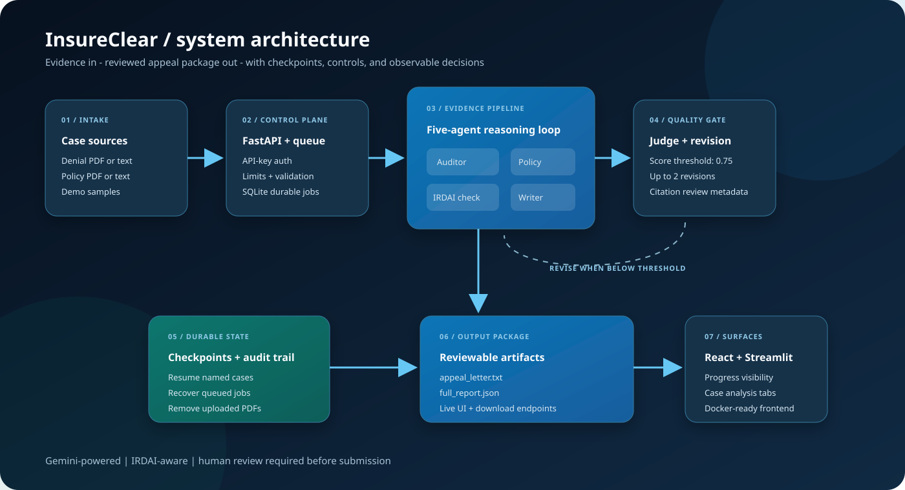
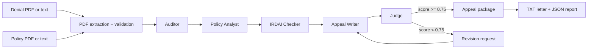
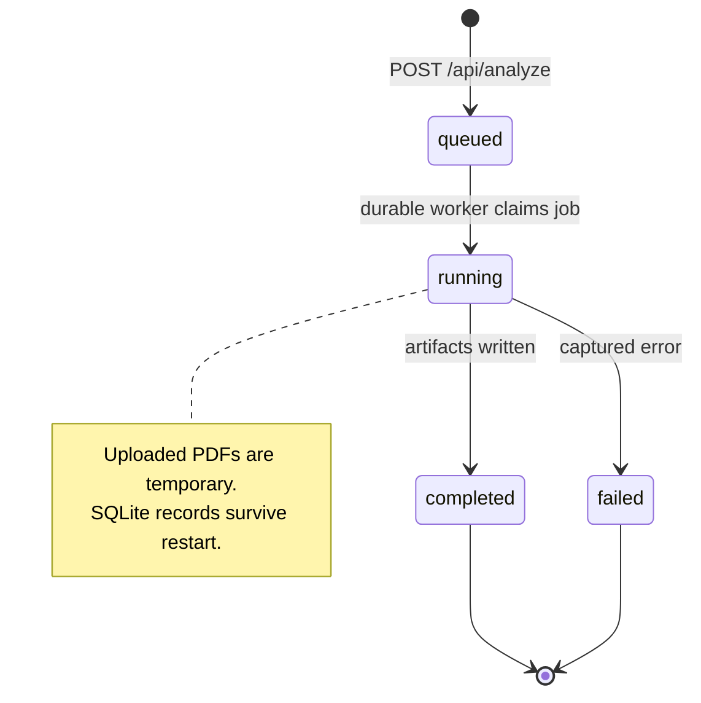
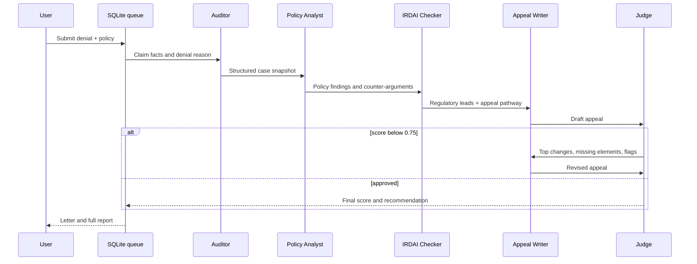

<div align="center">

# InsureClear

### Turn a rejected health claim into a reviewable appeal package.

<p>
  
  
  
  
</p>

<p>
  <a href="#experience-the-system">Experience the system</a> &nbsp; | &nbsp;
  <a href="#architecture">Architecture</a> &nbsp; | &nbsp;
  <a href="#run-it">Run it</a> &nbsp; | &nbsp;
  <a href="#api-surface">API</a> &nbsp; | &nbsp;
  <a href="docs/DEPLOYMENT.md">Deploy</a>
</p>

</div>

---

## The Product

InsureClear is a multi-agent AI system for rejected Indian health-insurance
claims. It reads a denial letter and the relevant policy, separates facts from
interpretation, finds possible policy and regulatory arguments, drafts an
appeal, and sends the result through a quality gate before creating the final
package.

It is built for **reviewable assistance**, not automatic legal advice:
uncertain citations are labelled for manual verification, source documents are
not retained after API processing, and a person must review the letter before
sending it.

<div align="center">



</div>

## Why It Is Interesting

| Problem | InsureClear response |
|---|---|
| A denial mixes facts, clauses, and conclusions | The Auditor creates a structured case snapshot. |
| Policy language is difficult to challenge | The Policy Analyst looks for exclusions, limits, waiting periods, and counter-arguments. |
| Regulatory claims can be overconfident | The IRDAI Checker attaches source-review metadata and official portals. |
| A first draft may contain weak or unsupported arguments | The Judge scores it and can trigger up to two revisions. |
| Long-running jobs can disappear on restart | A SQLite-backed queue and checkpoints recover named cases. |
| Sensitive PDFs should not linger | Uploaded source files are removed after processing. |

---

## Experience The System

### Fastest path: run the built-in demo

```bash
python orchestrator/cli.py --demo
```

The demo uses the included sample denial and policy files. It produces:

```text
data/output/<case_id>_<timestamp>/
|-- appeal_letter.txt
`-- full_report.json
```

### Browser experience

```bash
# Terminal 1: API
uvicorn web.api:app --reload --port 8000

# Terminal 2: React interface
cd web/frontend
npm install
npm run dev
```

Open `http://localhost:5173`.

The interface provides:

- Demo, plain-text, and PDF input modes
- Live job progress across every agent stage
- Case snapshot and policy analysis views
- IRDAI findings and citation-review status
- Judge scorecard and revision state
- Appeal letter and JSON report downloads

### Streamlit experience

```bash
streamlit run app.py
```

---

## Architecture

### End-to-end reasoning flow



### Control plane and job lifecycle



### Agent responsibilities



<details>
<summary><b>Open the implementation map</b></summary>
<br />

| Layer | Implementation | Responsibility |
|---|---|---|
| Intake | `orchestrator/cli.py`, `web/api.py`, `app.py` | CLI, FastAPI, and Streamlit entry points |
| Extraction | `tools/pdf_reader.py` | Digital PDF extraction with Tesseract OCR fallback |
| Reasoning | `agents/` | Auditor, policy, IRDAI, writer, and judge agents |
| Orchestration | `orchestrator/main.py` | Sequencing, score threshold, revisions, progress events |
| State | `sessions/`, `tools/job_store.py` | Checkpoints and durable SQLite jobs |
| Artifacts | `tools/io_utils.py` | Appeal letter and full JSON report |
| Browser UI | `web/frontend/src/` | React workflow, progress rail, analysis tabs, downloads |
| Deployment | `Dockerfile`, `docker-compose.yml` | API, OCR dependencies, and Nginx frontend |

</details>

---

## Quality And Safety Controls

### Judge-gated output

The pipeline does not blindly accept the first draft:

- Approval threshold: `0.75`
- Maximum automatic revisions: `2`
- Judge checks factual accuracy, citation quality, argument strength, structure,
  missing elements, weak arguments, and hallucination flags

### Citation review

The application includes official starting points for verification:

- [IRDAI](https://irdai.gov.in/)
- [Bima Bharosa](https://bimabharosa.irdai.gov.in/)
- [Council for Insurance Ombudsmen](https://cioins.co.in/)

Generated regulatory entries are marked `manual_verification_required` unless
an exact official document has been checked. See
[docs/REGULATORY_SOURCES.md](docs/REGULATORY_SOURCES.md).

### Privacy boundary

- API access can require `X-API-Key` authentication.
- Upload and text size limits are configurable.
- PDF signatures and content types are validated.
- Uploaded PDFs are deleted after processing.
- Job state is stored separately from source documents.
- Do not commit `.env`, claim documents, or generated personal data.

---

## Run It

### Requirements

- Python 3.10+
- Gemini API key
- Node.js and npm for the React UI
- Tesseract and Poppler for scanned PDFs outside Docker

### Install

```bash
git clone https://github.com/Harsh-4210/insureclear.git
cd insureclear

python -m venv venv
venv\Scripts\activate        # Windows
# source venv/bin/activate   # macOS/Linux

pip install -r requirements.txt
```

Create `.env` from the template:

```bash
copy .env.example .env     # Windows
# cp .env.example .env     # macOS/Linux
```

Set `GEMINI_API_KEY` in `.env`. The current default model is
`gemini-3.6-flash`; override it with `GEMINI_MODEL` when needed.

### Input modes

```bash
# Built-in sample
python orchestrator/cli.py --demo

# PDF documents
python orchestrator/cli.py --denial data/input/denial.pdf --policy data/input/policy.pdf

# Plain text documents
python orchestrator/cli.py --text-denial denial.txt --text-policy policy.txt

# Resume a named case or force a clean rerun
python orchestrator/cli.py --demo --case case_001
python orchestrator/cli.py --demo --case case_001 --fresh
```

### Docker

```bash
copy .env.example .env     # Windows
# cp .env.example .env     # macOS/Linux
docker compose up --build
```

- Frontend: `http://localhost:8080`
- API: `http://localhost:8000`
- Health: `http://localhost:8000/health`

See [docs/DEPLOYMENT.md](docs/DEPLOYMENT.md) and
[docs/OCR_SETUP.md](docs/OCR_SETUP.md) for production and OCR configuration.

---

## API Surface

All protected endpoints accept `X-API-Key` when authentication is enabled.

| Method | Endpoint | Purpose |
|---|---|---|
| `GET` | `/health` | Service health check |
| `POST` | `/api/analyze` | Queue a demo, text, or PDF analysis |
| `GET` | `/api/jobs/{job_id}` | Read job status and progress |
| `GET` | `/api/jobs/{job_id}/letter` | Return appeal text |
| `GET` | `/api/jobs/{job_id}/report` | Return the full report as JSON |
| `GET` | `/api/jobs/{job_id}/download/letter` | Download `appeal_letter.txt` |
| `GET` | `/api/jobs/{job_id}/download/report` | Download `full_report.json` |

<details>
<summary><b>Example API submission</b></summary>
<br />

```bash
curl -X POST http://localhost:8000/api/analyze \
  -F "mode=demo" \
  -F "case_id=demo_case"
```

With authentication:

```bash
curl -H "X-API-Key: $INSURECLEAR_API_KEY" \
  http://localhost:8000/api/jobs/<job_id>
```

</details>

---

## Test And Ship

```bash
# Backend tests
.venv\Scripts\python.exe -m pytest tests -q

# Frontend production build
cd web/frontend
npm run build
```

The test suite covers pipeline execution, judge thresholds, revision behavior,
PDF extraction, OCR fallback, API lifecycle, upload validation, and artifact
creation.

---

## Project Structure

```text
insureclear/
|-- agents/                 Five specialized reasoning agents
|-- orchestrator/           Pipeline orchestration and CLI
|-- tools/                  OCR, LLM, persistence, source metadata, queue
|-- web/api.py              FastAPI service and durable worker
|-- web/frontend/           React + Vite interface and Nginx image
|-- data/samples/           Built-in demo documents
|-- docs/                   Deployment, OCR, regulatory, architecture visual
|-- tests/                  Automated backend and pipeline tests
|-- Dockerfile              API image with Poppler and Tesseract
|-- docker-compose.yml      API + frontend deployment
`-- app.py                  Streamlit interface
```

---

## Responsible Use

InsureClear helps organize evidence and prepare a draft. It does not guarantee
claim approval, replace a lawyer, or establish that an insurer violated a law.
Review every personal detail, policy clause, deadline, citation, and generated
argument before submission.

<div align="center">

### Built for clearer decisions, not louder claims.

<a href="https://github.com/Harsh-4210/insureclear">Source</a> &nbsp; | &nbsp;
<a href="docs/REGULATORY_SOURCES.md">Sources</a> &nbsp; | &nbsp;
<a href="docs/DEPLOYMENT.md">Deployment</a>

</div>
